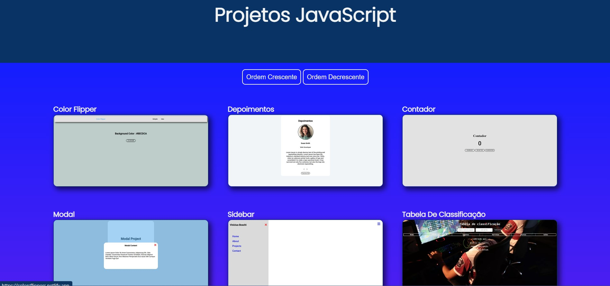

### **Projetos de JavaScript**

## Um [site](vanillaprojects.netlify.app) feito para conter todos os projetos de JavaScript.

1. Objetivos do site  
Sites feitos com o objetivo de treinar JS.

2. Seção Inicial  
 

3. Tecnologia usadas:  

*  
*  
*  
*  